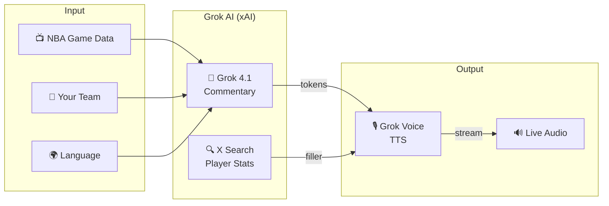
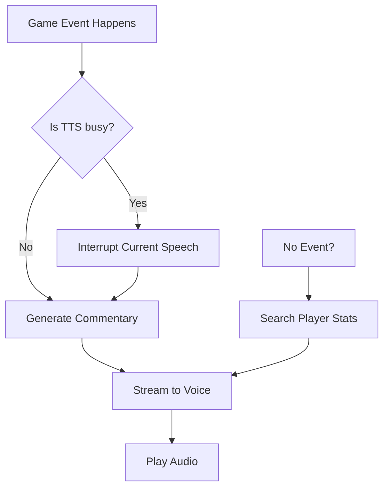

# GrokCast NBA Architecture

## How It Works



## Simple Flow



## Real-Time Pipeline

```
NBA Play-by-Play  →  Grok 4.1 LLM  →  Grok Voice TTS  →  Speaker
     (JSON)           (tokens)         (WebSocket)       (audio)
                          ↓
                    X Search fills
                    quiet moments
```
