# Grok NBA Commentary - Architecture

## Data Flow (Current Pipeline)

```mermaid
flowchart LR
    JSON[("NBA Events<br/>JSON")] --> MERGE["Merge Events"]
    MERGE --> GROK["Grok LLM"]
    GROK --> TTS["xAI TTS"]
    TTS --> PLAY["🔊 Speaker"]
```



## Streaming Flow (Low Latency)

```mermaid
flowchart LR
    subgraph STREAM["⚡ Real-Time Streaming"]
        EVENT["NBA Event"] --> LLM["Grok LLM"]
        LLM -->|"token stream"| TTS["Streaming TTS<br/>(WebSocket)"]
        TTS -->|"audio chunks"| SPEAKER["🔊 Speaker"]
    end
    
    style STREAM fill:#e8f5e9
```



## Latency Comparison


## Key Components

| Component | Mode | Latency |
|-----------|------|---------|
| `grok_script.py` | Batch | ~5s to first audio |
| `streaming_tts.py` | WebSocket | ~200ms to first audio |

## Streaming Advantage

```
Batch:     [===LLM===][===TTS===][===PLAY===]  → 5+ seconds
Streaming: [=LLM=====]                          → 200ms
            [=TTS====]
             [=PLAY===]
```

