# GrokCast NBA Architecture

## How It Works

```mermaid
flowchart LR
    subgraph Input
        A[📺 NBA Game Data]
        B[🏀 Your Team]
        C[🌍 Language]
    end

    subgraph "Grok AI (xAI)"
        D[🧠 Grok 4.1\nCommentary]
        E[🔍 X Search\nPlayer Stats]
    end

    subgraph Output
        F[🎙️ Grok Voice\nTTS]
        G[🔊 Live Audio]
    end

    A --> D
    B --> D
    C --> D
    D -->|tokens| F
    E -->|filler| F
    F -->|stream| G
```



## Simple Flow


## Real-Time Pipeline

```
NBA Play-by-Play  →  Grok 4.1 LLM  →  Grok Voice TTS  →  Speaker
     (JSON)           (tokens)         (WebSocket)       (audio)
                          ↓
                    X Search fills
                    quiet moments
```
